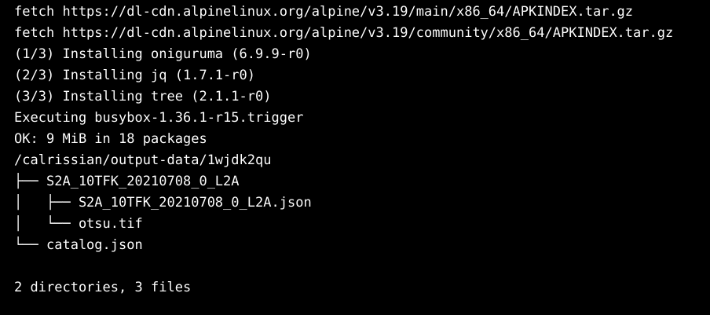

# Validation of Calrissian installation 

To validate Calrissian installation on minikube cluster we can run a water body app.
to deploy the job on minikube cluster follow steps bellow:

1- Start minikube cluster
```python
minikube start 
```

2- create a namespace using kubectl on your terminal


```python
NAMESPACE_NAME=test # you can replace it with your name
kubectl create namespace "$NAMESPACE_NAME"
```
3- create roles and roleBindings
```python
kubectl --namespace="$NAMESPACE_NAME" create role pod-manager-role \
  --verb=create,patch,delete,list,watch --resource=pods
kubectl --namespace="$NAMESPACE_NAME" create role log-reader-role \
  --verb=get,list --resource=pods/log
kubectl --namespace="$NAMESPACE_NAME" create rolebinding pod-manager-default-binding \
  --role=pod-manager-role --serviceaccount=${NAMESPACE_NAME}:default
kubectl --namespace="$NAMESPACE_NAME" create rolebinding log-reader-default-binding \
  --role=log-reader-role --serviceaccount=${NAMESPACE_NAME}:default
```
4- Create two ConfigMap to mount 2 files to PVCs:
```python
kubectl create configmap water-conf -n test --from-file=app-water-body-cloud-native.cwl
kubectl create configmap params-conf -n test --from-file=params.yaml
```

5- Apply Calrissian Jobs on cluster
```python
kubectl -n "$NAMESPACE_NAME" create -f calrissian-val.yaml
```
6- After completing jobs lets view the results
```python 
kubectl -n "$NAMESPACE_NAME" create -f view-results.yaml
```
6.1 Log from results
```python
kubectl --namespace="$NAMESPACE_NAME" logs -f jobs/view-results
```
> Note: Expected results:
> 
>

5- Check the resources in the namespace
```python
kubectl -n "$NAMESPACE_NAME" get all
```


6- Delete Calrissian from namespace:
```python
kubectl -n "$NAMESPACE_NAME" delete -f calrissian-install.yaml 
```
