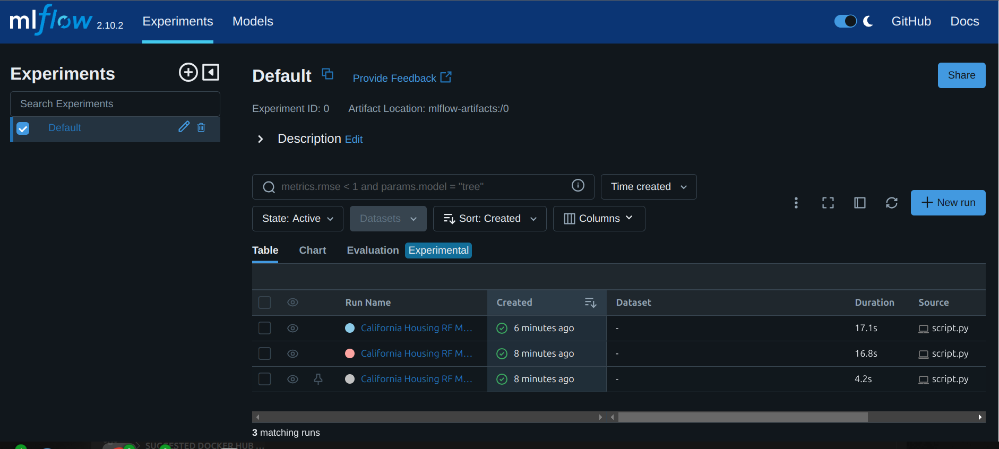
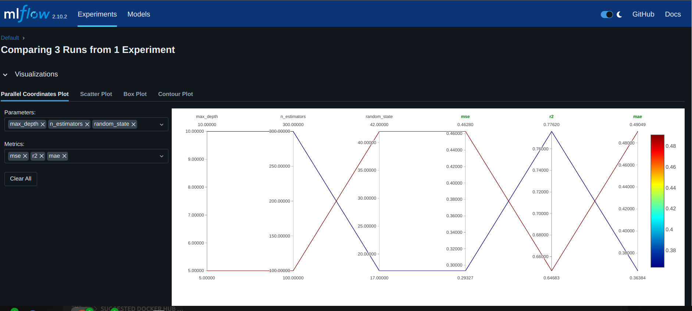
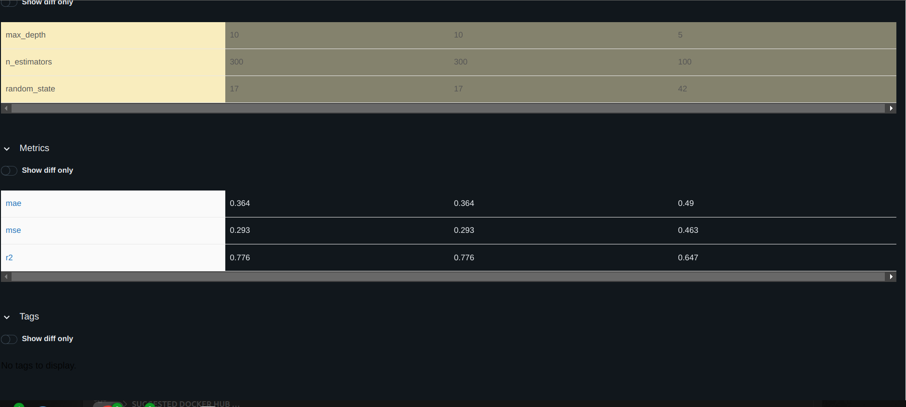

# Create a CWL workflow that runs a simple training job

To execute a CWL workflow that runs a simple training job and track it using mlflow we can follow the bellow steps:

1- Install dependencies and start mlflow ui using mlflow.cwl
```python
cwltool mlflow.cwl 
```

2- On a new terminal run workflow to track the proccess and generate `importance.csv` file
```python
cwltool workflow.cwl inputs.yml
```


3- Results
- On terminal:
```python
INFO /home/t2/miniconda3/bin/cwltool 3.1.20231114134824
INFO Resolved 'workflow.cwl' to 'file:///home/t2/Desktop/kube/minio/simple-training-job/workflow.cwl'
INFO [workflow ] start
INFO [workflow ] starting step run_srcipt
INFO [step run_srcipt] start
INFO [job run_srcipt] /tmp/6isx6bcb$ python \
    script.py
Run ID: 23b64df0afed4c64be32ec4473ce6bf0
INFO [job run_srcipt] Max memory used: 368MiB
INFO [job run_srcipt] completed success
INFO [step run_srcipt] completed success
INFO [workflow ] completed success
{
    "importance_file": {
        "location": "file:///home/t2/Desktop/kube/minio/simple-training-job/importance.csv",
        "basename": "importance.csv",
        "class": "File",
        "checksum": "sha1$cb785dcd221c79fd9ccd4fa804a5c91863500386",
        "size": 256,
        "path": "/home/t2/Desktop/kube/minio/simple-training-job/importance.csv"
    }
```

- On mlflow ui:
    - Different runs:

    
    - Overview:

    
    - Parameters' differentiation

    
    - Metrics:

    
